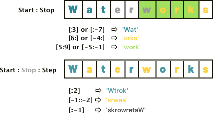

# Lists & Tuples Slicing Exercises

&nbsp;


<div width="95%">
<table style="border: none;">
  <tr style="border: none;">
    <th style="border: none;"></th>
    
   <th style="border: none;"></th>
   
</table>
</div>
<br>


#### General Review

_Tuples & Lists are different [**sequence types**](https://docs.python.org/3/library/stdtypes.html#sequence-types-list-tuple-range).  Lists are **mutable** ,  Tuples are **not mutable**.  Despite this difference, the overall **sequence type** supports the same indexing, slicing, & identity operations.   See the link for detailed information from the docs.  **Note:**  The slicing action returns a **copy** of either the Tuple or the List being sliced._

*Slice Notation, Slicing*

- [How Do I Use the Slice Notation in Python?](https://www.oreilly.com/learning/how-do-i-use-the-slice-notation-in-python)
- [Stackoverflow: Explain Python's Slice Notation](https://stackoverflow.com/questions/509211/explain-pythons-slice-notation)
- [Python Sequence Slicing Guide](http://www.datadependence.com/2016/05/python-sequence-slicing-guide/)

&nbsp;


```python
numbers  =  [1,2,3,4,5,6,7,8,9,10]
alpha_j  =  [item for item in 'abcdefghij']
phrase =  ('Today', 'is', 'Saturday', 'April', '8th')
phrase_II =  ('I', 'do', 'not', 'like', 'green', 'eggs', 'and', 'Ham')
phrase_III =  ['And', 'the', 'secret', 'is', 'mapS']
```

&nbsp;

#### Using slice notation on the Lists & Tuples above:

1.   Return a copy of the "numbers" list
2.   Return a copy of the "phrase" Tuple that reads ("Today", "is", "Saturday")
3.   Return the first three items in the "alpha_j" list
4.  The slice of "phrase_II" that reads ("not", "like", "green")
5.  The slice of "numbers" that reads [10,9,8,7,6,5,4,3,2,1]
6.  The slice of "phrase_II" that reads ("and", "Ham")

&nbsp;

#### Using slice notation with a **step** on the Lists & Tuples above:

1. Return every second item from the "alpha_j" list.
2. Return all the **even** numbers in the "numbers" list, lowest to highest.
3. Return all the **odd**  numbers in the "numbers" list, lowest to highest.  (_Try to NOT use sort._)
4. Return the slice of "phrase_II" that reads ("green", "like", "not")
5. Return the slice of "phrase_III" that reads 'Spam' (hint*:  you can take a slice of a slice*)
6. Return the slice of "phrase" that reads ("Saturday", "is", "today")
