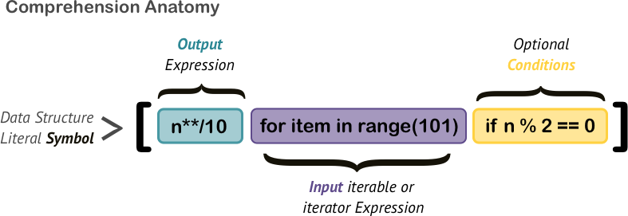

# Loops to Comprehensions & Conditionals to Ternaries

&nbsp;

<table style="border: none;">
  <tr style="border: none;">
    <th style="border: none;"> </th>
    <td width="50%" align="right" style="border: none;"> </td>
  </tr>
  <tr>
   <th style="border: none;"> </th>
    <td width="50%" align="right" style="border: none;"></td>
  </tr>
</table>

 

### General Review

