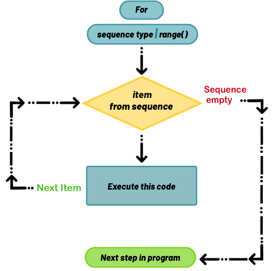

# While & For Loop Exercises

&nbsp;


<div width="95%">
<table style="border: none;">
  <tr style="border: none;">
    <th style="border: none;"></th>
    
   <th style="border: none;"></th>
   
</table>
</div>
<br>


### General Review

&nbsp;

**FOR LOOP** :
_A **for loop** implements the repeated execution of code based on a **loop counter or loop variable**. This means that for loops are used most often when the number of iterations is **known before entering the loop,** unlike while loops which are conditionally based._  [**How To Construct For Loops in Python3**](https://www.digitalocean.com/community/tutorials/how-to-construct-for-loops-in-python-3): Lisa Tagliaferri, DigitalOcean

----

**WHILE LOOP**:  _A **while loop** implements the **repeated execution of code based on a given Boolean condition.** The code that is in a while block will execute as long as the while statement evaluates to True._

_You can think of the while loop as a **repeating conditional statement**. After an if statement, the program continues to execute code, but in a while loop, the program jumps back to the start of the while statement until the condition is False._

_As opposed to for loops that execute a certain number of times, while loops are conditionally based, so you don’t need to know how many times to repeat the code going in._ -- [**How To Construct While Loops in Python3**](https://www.digitalocean.com/community/tutorials/how-to-construct-while-loops-in-python-3): Lisa Tagliaferri, DigitalOcean

&nbsp;


```python

#for/for each loop
for [iterating variable] in [sequence or range()]:
    [do some stuff]
 
#while loop   
while [a condition is True]:
    [do something]
 
 #do-while variant
 while [a condition is True]:
     [do something]
     if [the condition is now False]:
        [stop iterating via break keyword]

```

&nbsp;

#### Compose the following FOR loops:

1.  A loop that prints out a "multiplication table" for one number.  (_**e.g**  2x0 = 0, 2x1 = 2, 2x2 = 4, ... _)
    *  **variant**:  If you're comfortable with nested loops, see if you can print out the whole table for numbers 1-9.
2.  A loop that prints out "Peter Piper picked a peck of pickled peppers." six times.
3.  Using `possible_pets = ("dog", "cat", "parrot", "fish", "guinea pig" )`, make a loop that prints  _**"I have a [item] as a pet!".**_   (**Hint:**  you can use an [**f-string**](https://cito.github.io/blog/f-strings/) here in the form of `f'I have a {item} as a pet!'`
4.  Using `days = ['Sunday', 'Mothers Day', 'Monday', 'Arbor Day', 'Tuesday', 'Labor Day','Wednesday', 'Memorial Day', 'Thursday', 'Fathers Day', 'Friday', 'Sarahs Birthday']` make a loop that prints only the days of the week.

&nbsp;

#### Compose the following WHILE loops:

1.  A loop that asks "Are we there yet?"  until you answer "YES".  **Hint:**  You cse `input()` to get user input from the command line.
2.  Using `days_of_week = [Sunday', 'Monday',  'Tuesday',  'Wednesday', 'Thursday', 'Friday']`, write a loop that `print(days_of_week.pop())` from the list **until** there is only 'Sunday' left.  
3.  Write a loop that creates a list of [**Fibonacci numbers**](https://en.wikipedia.org/wiki/Fibonacci_number) under  **233**
4.  Write a loop that prints  'onomatopoeia'.  _This will be an infinite loop that will have to be broken_.
